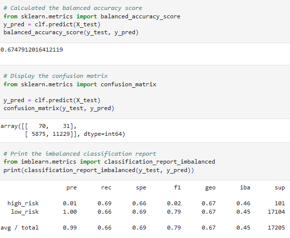
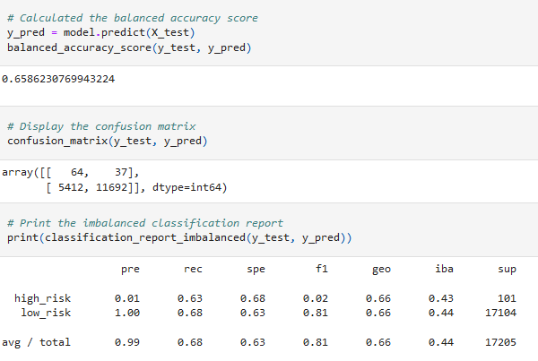
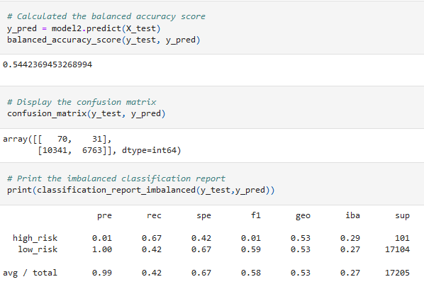
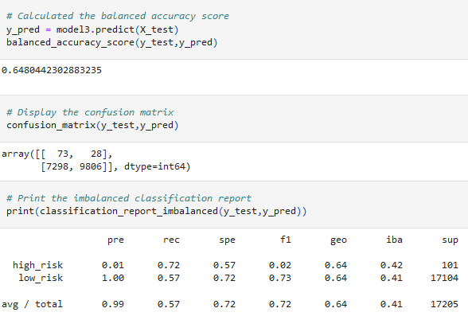
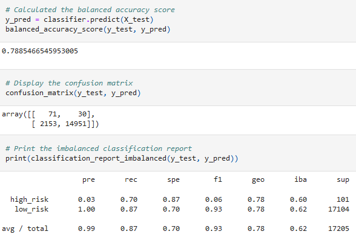
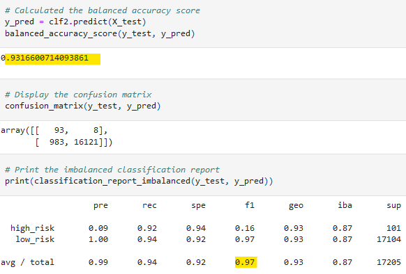

# Credit_Risk_Analysis

## Overview of Analysis
The purpose of this analysis was to train a different unsupervised machine learning models and use a variety of sampling and ensemble methods to predict credit fraud based on the given loan data. 

## Results
Here are the results of all 6 models created:
* Naive Random Oversampling

* SMOTE Oversampling

* Undersampling

* SMOTEENN

* Balanced Random Forest

* Easy Ensemble ADABooster

## Summary
Out of all the sampling/ensemble methods, we see that using the Easy Ensemble ADABooster classifier gives use the highest accuracy and f1 scores - as such I would recommend using this model. 

